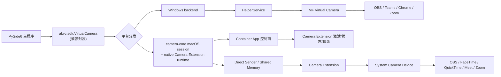

# 跨平台主程序统一接入架构

## 文档目标

本文档用于说明同一个 PySide6 主程序如何同时接入 Windows 和 macOS 的虚拟摄像头能力，并保持业务层接口统一、平台差异下沉。

适用场景：

- 你的应用是一个跨平台 PySide6 桌面程序
- 需要在 Windows 和 macOS 上都提供虚拟摄像头能力
- 不希望业务层写两套完全不同的接入逻辑

## 核心结论

统一的应该是：

- Python 兼容层接口
- 生命周期
- 错误模型
- 安装检查模型
- 推帧入口

不需要强行统一的应该是：

- 平台底层实现
- 原生系统组件形态
- 安装 / 激活机制

也就是说：

- Windows 保留 `MF virtual camera + helper`
- macOS 保留 `container app + Camera Extension`
- 你的 PySide6 业务层只依赖同一套 Python 兼容层 `VirtualCamera` 封装

## 统一架构图



## 分层原则

### 1. 业务层

你的主程序业务代码只做这些事：

- 创建 `VirtualCamera`
- 在合适时机调用 `install_extension()` / `status()`
- `start()`
- `send(frame)` / `push_frame(frame)`
- `stop()` / `close()`

它不应该直接知道：

- Windows 是否用了 helper
- macOS 是否用了 Camera Extension
- host/container app 的二进制路径

### 2. Python 兼容封装层

由 `akvc.sdk.VirtualCamera` 负责：

- 平台分发
- 参数兼容
- 生命周期统一
- 状态对象统一
- 对业务层屏蔽平台差异

### 3. 平台后端层

由平台后端负责吸收差异：

- Windows：
  - helper 进程
  - MF 注册
  - sink 写入
- macOS：
  - container app
  - system extension 激活
  - direct sender / shared memory
  - Camera Extension 设备可见性检查

## 推荐的上层使用方式

```python
from akvc.sdk import VirtualCamera

vc = VirtualCamera(width=1280, height=720, fps=30)

install_result = vc.install_extension_result()
if install_result is not None and not install_result.success:
    print(install_result.phase, install_result.status.last_error)

vc.start(name="AK Virtual Camera")
vc.send(frame)
vc.stop()
```

这个模型的好处是：

- Windows/macOS 都能复用
- 未来主程序改打包方式时，业务层几乎不动

## 平台差异应该落在哪

### Windows

平台差异应落在：

- `HelperService`
- `MFCreateVirtualCamera`
- Windows 专属 runtime 依赖

### macOS

平台差异应落在：

- container app 控制面
- camera-core macOS session / native control layer
- `Camera Extension`
- direct sender / shared memory
- container app 发现与激活逻辑

## 为什么 macOS 不应继续暴露独立 host 概念

如果业务层直接感知：

- `/Applications/<your-container-app>.app`
- `host_bundle`
- `host_executable`

那你的跨平台主程序会出现两个问题：

1. macOS 特有概念泄露到上层业务代码
2. 后面把 container app 改成你的正式主程序时，业务层还得跟着重写

因此更合理的语义是：

- 业务层知道“当前主程序是 container app”
- 不知道也不关心“独立 host app”是否存在

## 推荐的统一业务流程

### 首次启动

```text
主程序启动
-> 创建 VirtualCamera
-> 调用 install_extension_result()/status()
-> 如果未安装/待批准，提示用户完成安装或系统授权
-> 安装完成后允许开始推流
```

### 开始推流

```text
start()
-> Windows: helper + MF ready
-> macOS: Camera Extension ready + system device visible
-> send(frame)
```

### 关闭推流

```text
stop()/close()
-> 关闭 producer / sink / worker
-> 不要求卸载系统设备
```

## 对主程序打包的要求

### Windows

- 主程序能携带 helper/runtime 即可

### macOS

- 主程序必须是正式 `.app`
- 主程序需要作为 Camera Extension 的 container app
- 扩展必须内嵌在主程序 bundle 中

## 对你的项目的直接收益

这套结构会让你的项目具备：

1. 一套业务层接入代码
2. 两套平台后端实现
3. 后续可继续扩展 Linux 而不污染业务层
4. 更容易做统一 QA、统一日志和统一安装引导

## 建议的后续落地顺序

1. 先把 macOS 的 `host_*` 语义下沉成 `container app` 语义
2. 再让你的主程序 `.app` 接管 container 角色
3. 保持 `VirtualCamera` 兼容封装不变
4. 最后统一桌面端安装提示与错误提示
