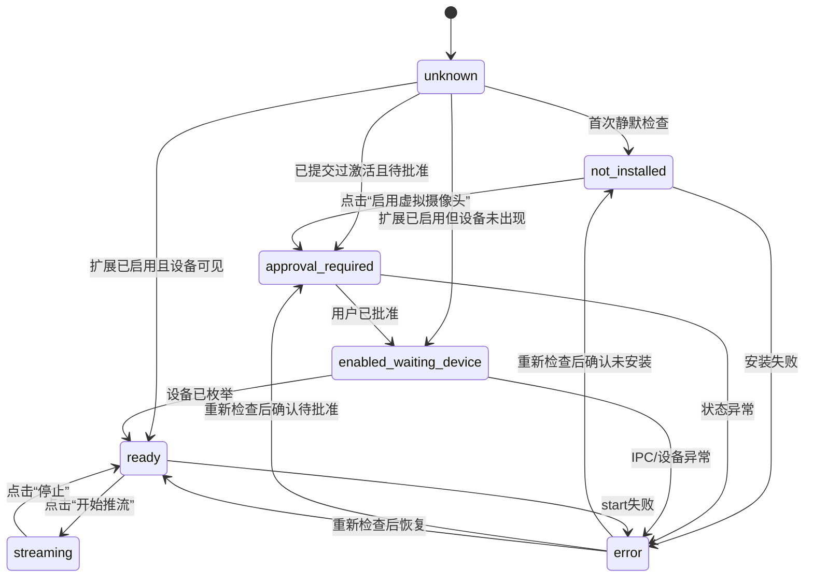

# 主程序中的 macOS Camera Extension 安装/激活状态机

## 文档目标

本文档定义跨平台 PySide6 主程序在 macOS 上接入 Camera Extension 时，推荐采用的安装、激活、状态检查和推流解锁流程。

目标：

- 不在应用冷启动时粗暴打断用户
- 把系统扩展安装/批准放到“用户真正需要虚拟摄像头功能”的上下文里
- 让 UI 和后端职责清晰
- 让后续 Windows/macOS 共用一套业务层交互模型

## 核心原则

一句话原则：

`启动时检查，进入功能页时引导，用户明确点击时激活。`

不推荐：

- 应用一启动就自动弹系统扩展安装
- 每次启动都重复提交激活请求
- 用户还没使用虚拟摄像头能力就被系统批准流程打断

推荐：

- 冷启动时静默检查状态
- 用户进入虚拟摄像头页时显示 readiness
- 用户点击“启用虚拟摄像头”时才真正提交 `OSSystemExtensionRequest`

## 角色分层

## 1. View 层

负责：

- 展示当前安装/激活状态
- 展示下一步动作
- 提供按钮：
  - `启用虚拟摄像头`
  - `打开系统设置`
  - `重新检查`
  - `开始推流`

不负责：

- 直接拼接系统扩展命令
- 决定系统状态解释逻辑

## 2. ViewModel 层

负责：

- 管理安装/激活状态机
- 决定哪些按钮可点击
- 决定用户提示文案

不负责：

- 直接访问 Camera Extension 原生 API

## 3. Facade / Service 层

负责：

- 调用 `VirtualCamera` / `MacInstallerService`
- 轮询状态
- 执行安装、激活、重新检查、打开设置

## 4. 平台后端层

负责：

- `install_extension_result()`
- `status()`
- `open_install_settings()`
- `start()`
- `send(frame)`

## 推荐用户流程

## 冷启动

```text
应用启动
-> 静默调用 status()/install_extension_result()
-> 不弹系统安装请求
-> UI 只更新当前状态
```

用户看到的应该是：

- “未安装”
- “等待系统批准”
- “已启用，可开始推流”

而不是系统突然弹窗。

## 用户进入“虚拟摄像头”功能页

```text
进入功能页
-> 触发一次 recheck_install_status()
-> 展示当前 readiness stage / next action
-> 根据状态显示按钮
```

此时才是最合适的引导点，因为用户已经表达了功能意图。

## 用户点击“启用虚拟摄像头”

```text
用户点击启用
-> install_extension_result()
-> 若需要，提交 OSSystemExtensionRequest
-> 返回 phase/state/message
-> UI 更新为“等待用户批准”或“已启用”
```

这是推荐的真正激活时机。

## 用户批准后

```text
批准完成
-> 用户回到应用点击“重新检查”
-> 或应用定时轮询 status()
-> 状态进入 activated enabled
-> 若系统设备已枚举，解锁“开始推流”
```

## 用户点击“开始推流”

```text
开始推流
-> start()
-> 如果 stream_start_ready == false，阻止启动并提示原因
-> 如果 ready，开始发送帧
```

## 推荐状态机

建议主程序内部统一使用以下高层状态。

## 顶层状态

| 状态 | 说明 | UI 重点 |
|---|---|---|
| `unknown` | 尚未完成首次检查 | 显示加载中 |
| `not_installed` | 尚未安装或未激活 | 显示“启用虚拟摄像头” |
| `approval_required` | 已提交激活，等待用户批准 | 显示“打开系统设置” |
| `enabled_waiting_device` | 扩展已启用，但系统设备尚未出现 | 显示“重新检查” |
| `ready` | 扩展已启用且系统设备已可见 | 解锁“开始推流” |
| `streaming` | 正在推流 | 解锁“停止” |
| `error` | 当前检查或安装失败 | 显示错误与下一步 |

## 与现有 readiness 对应

可以和仓库现有字段做近似映射：

| 现有 readiness/stage | 推荐上层状态 |
|---|---|
| `not_activated` | `not_installed` |
| `waiting_user_approval` | `approval_required` |
| `waiting_device_enumeration` | `enabled_waiting_device` |
| `ready_for_app_validation` | `ready` |
| `ipc_not_ready` | `enabled_waiting_device` 或 `error` |
| `host_or_install_blocked` | `error` |

## 推荐按钮策略

## 状态到按钮映射

| 状态 | 启用虚拟摄像头 | 打开系统设置 | 重新检查 | 开始推流 | 停止 |
|---|---|---|---|---|---|
| `unknown` | 禁用 | 禁用 | 禁用 | 禁用 | 禁用 |
| `not_installed` | 启用 | 禁用 | 启用 | 禁用 | 禁用 |
| `approval_required` | 可选禁用 | 启用 | 启用 | 禁用 | 禁用 |
| `enabled_waiting_device` | 禁用 | 可选启用 | 启用 | 禁用 | 禁用 |
| `ready` | 禁用 | 可选禁用 | 启用 | 启用 | 禁用 |
| `streaming` | 禁用 | 禁用 | 可选禁用 | 禁用 | 启用 |
| `error` | 视错误类型决定 | 视错误类型决定 | 启用 | 禁用 | 禁用 |

## 推荐文案策略

## 冷启动后的状态提示

### `not_installed`

- 标题：`虚拟摄像头尚未启用`
- 描述：`当前主程序还没有完成 Camera Extension 安装/激活。`
- 主按钮：`启用虚拟摄像头`

### `approval_required`

- 标题：`等待系统批准`
- 描述：`系统扩展已提交，请在系统设置中批准 Camera Extension。`
- 主按钮：`打开系统设置`
- 次按钮：`重新检查`

### `enabled_waiting_device`

- 标题：`已启用，等待系统设备出现`
- 描述：`Camera Extension 已启用，但系统摄像头列表里暂时还没出现目标设备。`
- 主按钮：`重新检查`

### `ready`

- 标题：`虚拟摄像头已就绪`
- 描述：`系统已经能看到虚拟摄像头，可以开始推流。`
- 主按钮：`开始推流`

### `error`

- 标题：`虚拟摄像头暂不可用`
- 描述：显示后端返回的 `install_message / last_error / stream_start_message`
- 主按钮：根据问题类型选择 `重新检查` 或 `启用虚拟摄像头`

## 推荐后端调用时机

## 1. 应用启动时

调用：

- `status()` 或 `install_extension_result()` 的轻量版本

要求：

- 不能触发系统弹窗
- 只更新本地状态

## 2. 进入虚拟摄像头页时

调用：

- `recheck_install_status()`

要求：

- 刷新 UI
- 刷新 readiness / next action

## 3. 用户点击“启用虚拟摄像头”时

调用：

- `install_extension_result()`

要求：

- 允许真正提交 `OSSystemExtensionRequest`
- 允许进入等待批准状态

## 4. 用户点击“开始推流”时

调用：

- `start()`

要求：

- 必须先检查 `stream_start_ready`
- 未就绪时直接提示，不进入半启动状态

## 推荐轮询策略

### 冷启动后

- 做一次静默检查即可

### 功能页打开后

- 每 `1~2s` 轮询一次状态
- 在 `approval_required` / `enabled_waiting_device` 阶段继续轮询

### `ready` 之后

- 可以降低轮询频率
- 推流期间只保留轻量状态轮询

## 推荐 UI 状态机图



## 跨平台建议

这套状态机不只适用于 macOS，也方便和 Windows 统一。

### Windows

可以映射为：

- `not_installed`：helper/runtime 未就绪
- `ready`：MF 虚拟摄像头已可用
- `streaming`：正在推流

### macOS

保留完整流程：

- `not_installed`
- `approval_required`
- `enabled_waiting_device`
- `ready`
- `streaming`

这样你的业务层仍然可以共用同一套 UI 框架，只是 macOS 会多几个中间态。

## 对你的主程序的最终建议

推荐最终交互是：

1. 主程序启动时静默检查
2. 用户进入虚拟摄像头页时展示状态
3. 用户点击“启用虚拟摄像头”时触发系统激活
4. 用户批准后点击“重新检查”
5. 状态 ready 后才允许“开始推流”

这样用户体验最好，也最符合 macOS System Extension 的使用习惯。
