# Class Diagram — Cross-Platform Virtual Camera

**项目代号**：AK Virtual Camera
**文档版本**：v1.0
**阶段**：Phase 1 — 系统架构设计
**前置文档**：`system-design.md`

> 本文用 Mermaid 绘制系统全部关键类图，覆盖：camera-core、ServiceFacade、ViewModel、平台抽象、Windows 原生、macOS 原生、Helper 协议。
> 类图聚焦**契约**（字段、方法、依赖、错误模型），不写实现细节。

---

## 1. Camera Core — Frame Provider

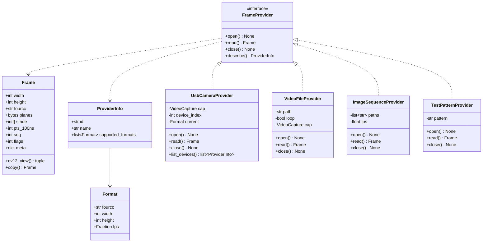

**契约**：
- `read()` 阻塞最长 1 帧周期；超时返回最近一帧的副本，并设 `flags |= STALE`。
- `read()` 永不抛异常向上；底层失败转为 `flags |= ERROR` 的占位帧（黑色 + 时间戳 OSD）。
- `close()` 幂等。

---

## 2. Camera Core — Frame Pipeline

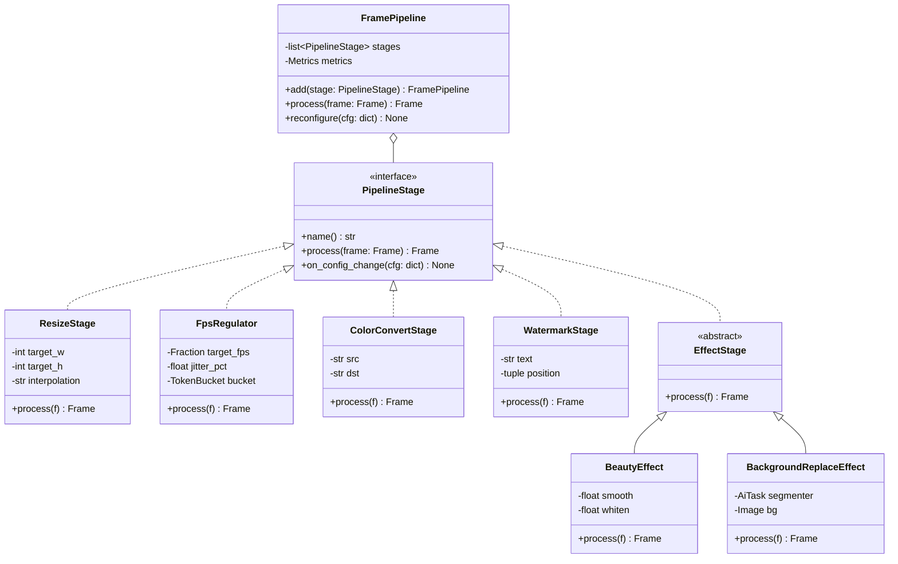

**契约**：
- 每个 Stage 必须**就地或新分配**返回 `Frame`，不得修改输入 Frame 的元数据指针。
- Stage 内部异常转为日志 + 透传上一帧（保证不中断帧流）。
- `reconfigure` 必须线程安全且不阻塞当前帧。

---

## 3. Camera Core — Frame Sink (IPC Writer)

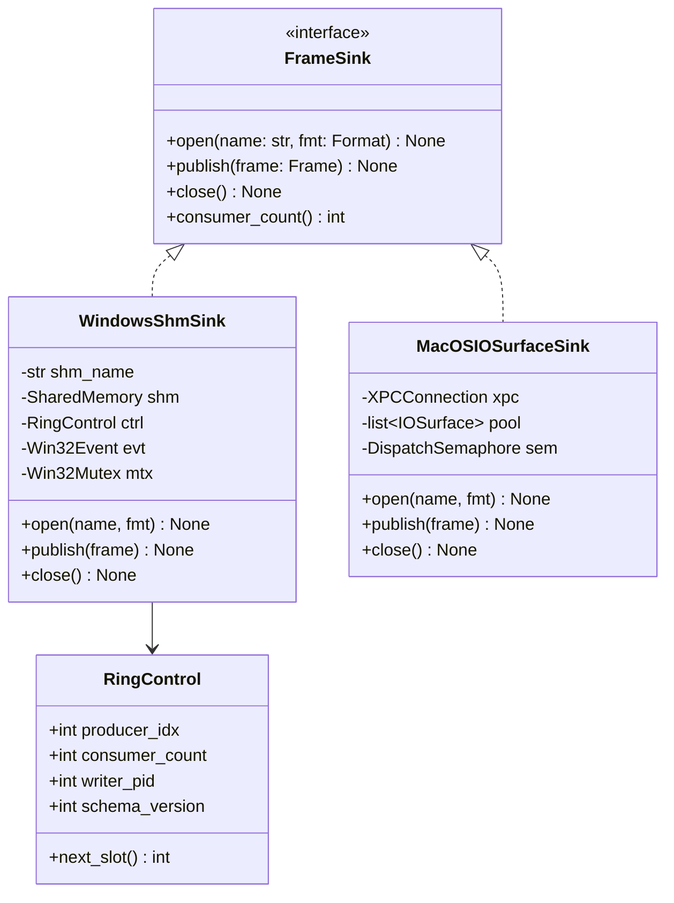

**契约**：
- `publish` 必须 O(1) 复杂度且不阻塞超过 1ms（1080p 拷贝预算）。
- ring 满时丢最旧（覆盖），并 `metrics.frame_drop++`。
- schema_version 不匹配 → 拒绝 open 并返回 `E_AKVC_FRAMEBUS_SCHEMA_MISMATCH`。

---

## 4. Camera Core — AI Hooks 与 Effects

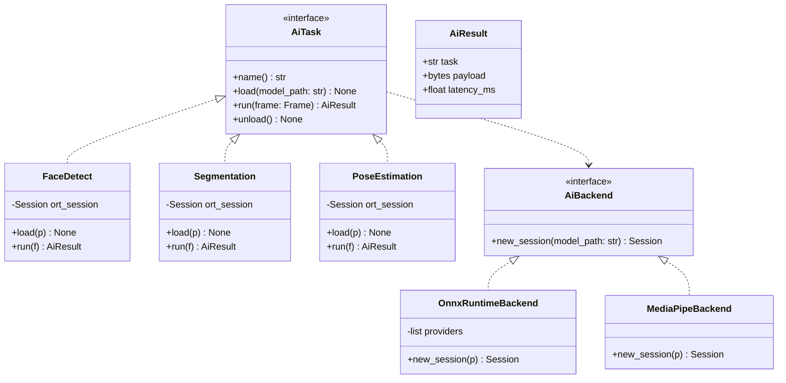

**Phase 1 仅落接口**；模型加载、推理实现 Phase 6+。

---

## 5. Application Service Layer

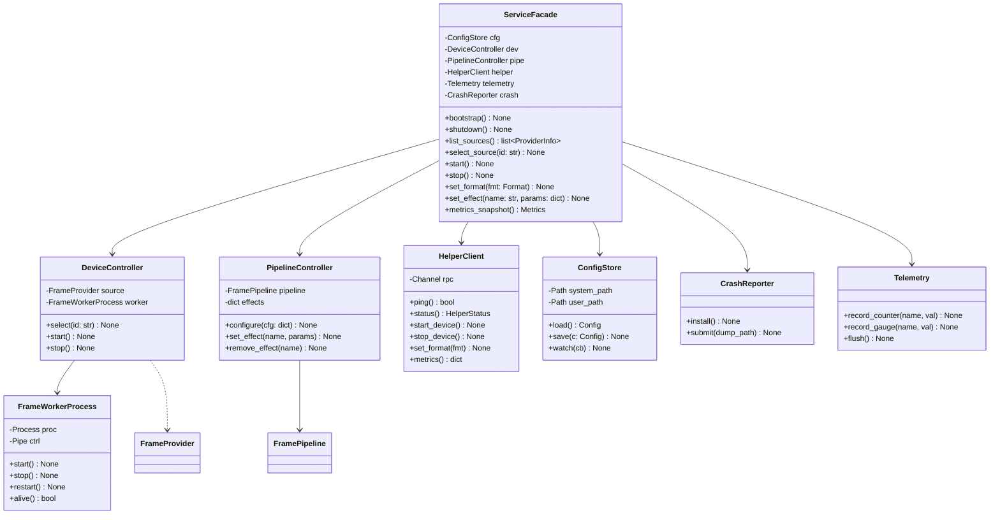

**契约**：
- `ServiceFacade` 是 ViewModel 唯一允许调用的入口（**MVVM 边界**）。
- 所有方法支持取消（接受 `Cancellation` token）；耗时操作返回 `Future`。
- `bootstrap` 幂等，可被 UI、CLI、测试夹具复用。

---

## 6. Presentation Layer — MVVM

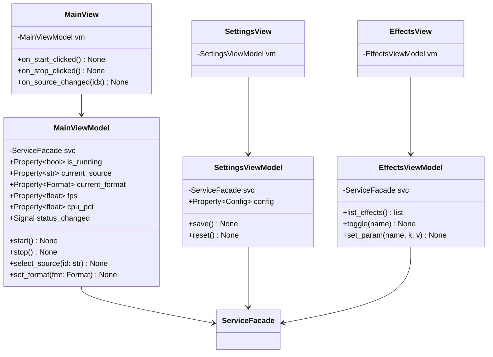

**契约**：
- View 不持有任何业务对象；只持有 ViewModel。
- ViewModel 不持有 Qt Widget；只发 Signal、暴露 Property。
- 测试时可以替换 `ServiceFacade` 为 `FakeServiceFacade`。

---

## 7. Platform Abstraction (Layer 2)

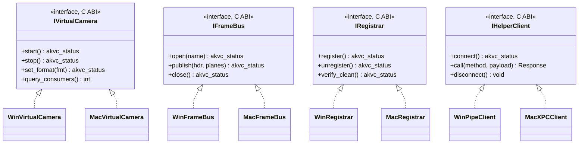

---

## 8. Windows Native — DirectShow 子系统

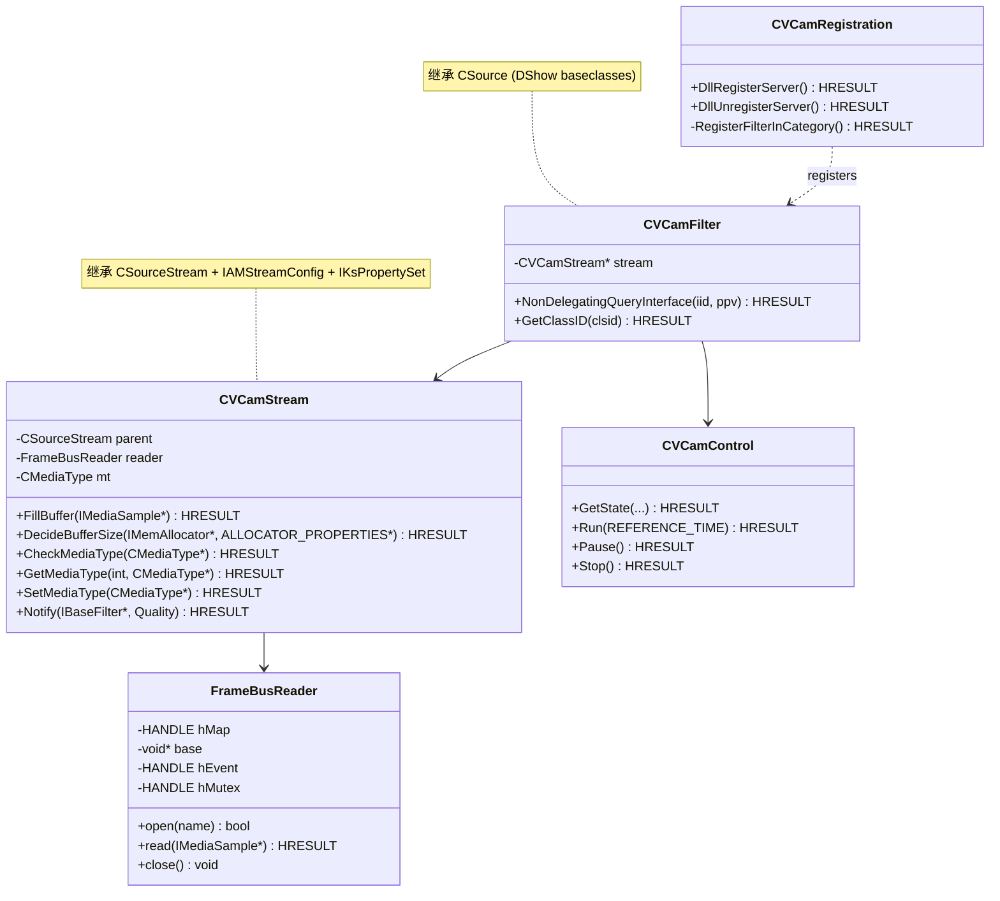

**关键点**：
- `FillBuffer` 阻塞等待 Event，最多 100ms；超时输出占位帧。
- `GetMediaType` 第 0 项必须为 NV12 1920x1080@30；后续按 §architecture-research.md 顺序枚举。

---

## 9. Windows Native — Media Foundation 子系统

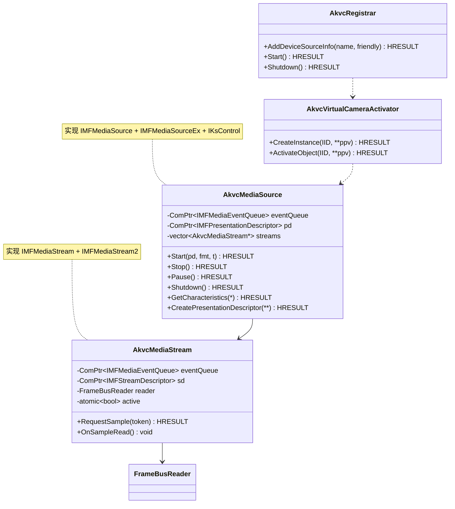

**关键点**：
- Activator 在 frameserver LowBox 中被实例化；不能假设有完整文件系统访问权。
- `RequestSample` 内部异步：投递 work item，从 ring 取帧后 `QueueEvent(MEMediaSample)`。

---

## 10. Windows Native — Helper Service

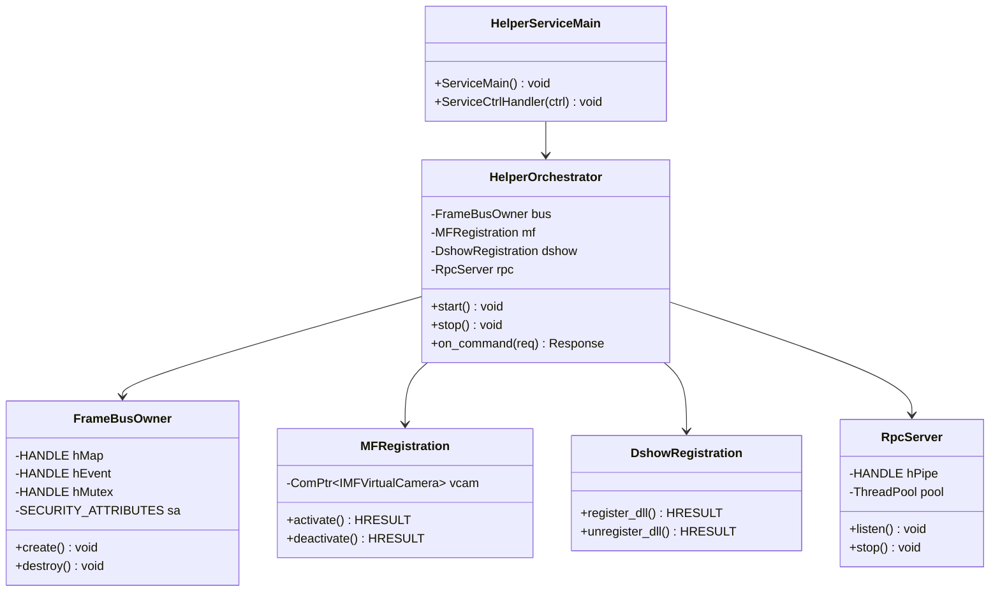

---

## 11. macOS Native — Camera Extension

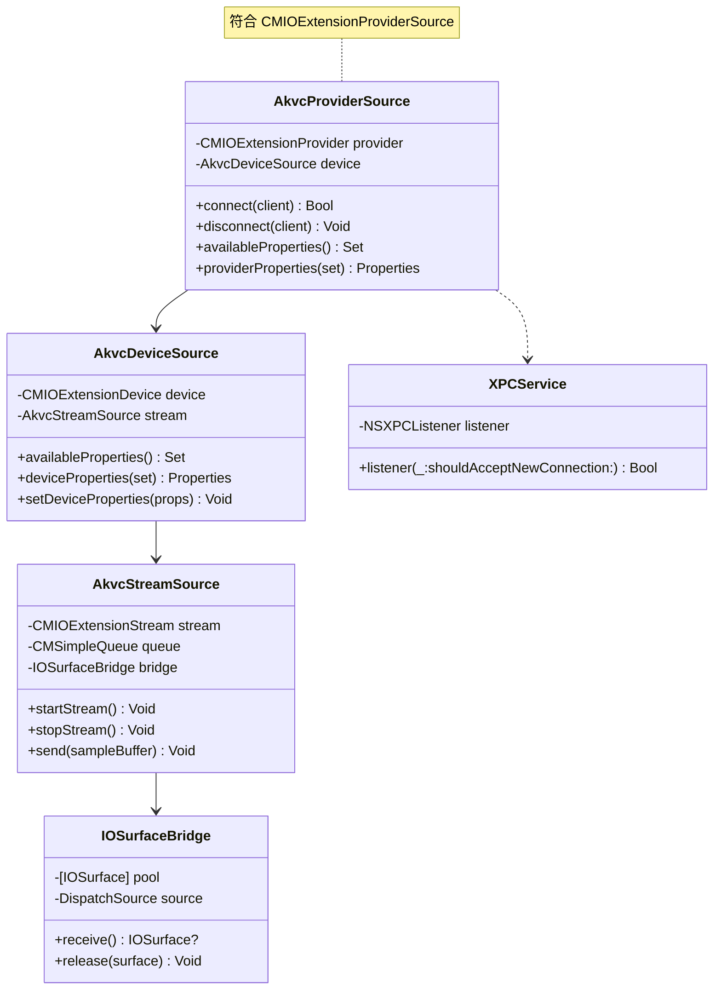

---

## 12. macOS Native — Helper (launchd)

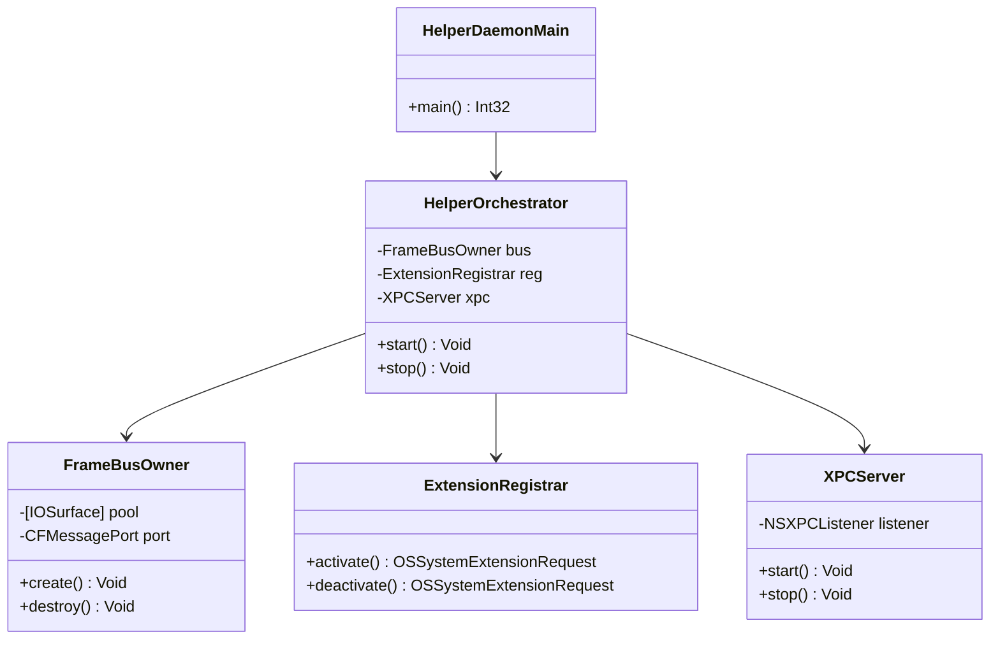

---

## 13. 控制面协议（IDL 视角）

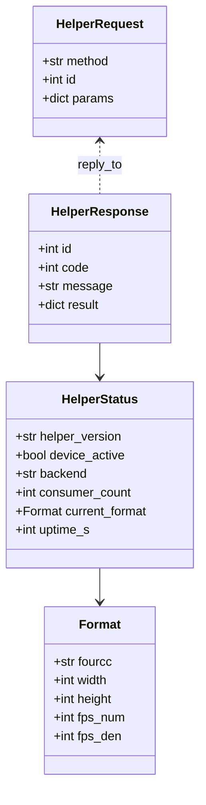

---

## 14. 错误模型

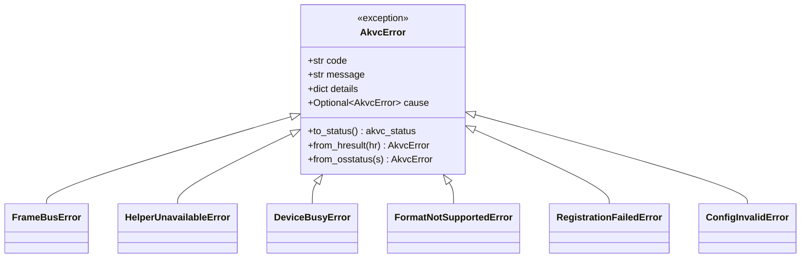

**错误码命名空间（节选）**：
- `E_AKVC_FRAMEBUS_OPEN_FAILED`
- `E_AKVC_FRAMEBUS_SCHEMA_MISMATCH`
- `E_AKVC_HELPER_NOT_RUNNING`
- `E_AKVC_HELPER_TIMEOUT`
- `E_AKVC_REG_DSHOW_REGSVR_FAILED`
- `E_AKVC_REG_MF_ACTIVATE_FAILED`
- `E_AKVC_REG_MAC_EXT_REJECTED`
- `E_AKVC_FORMAT_NOT_SUPPORTED`
- `E_AKVC_DEVICE_BUSY`
- `E_AKVC_CONFIG_INVALID`

每个错误码在 `virtualcam/shared/errors.h` 维护一对一映射，并在 `docs/operations/errors.md` 留有"用户级人话解释"。

---

## 15. 类图整体依赖（顶层一图）

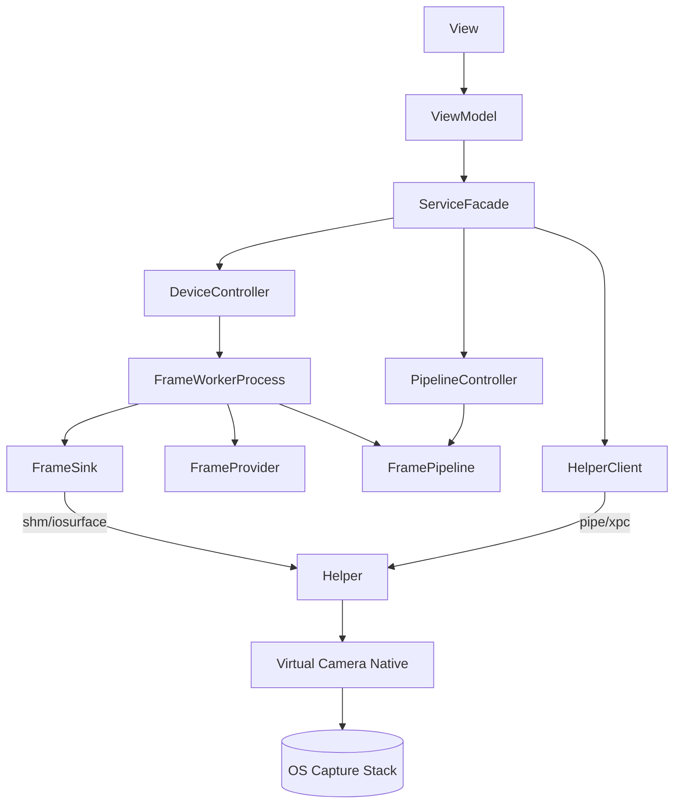

---

## 16. 验证清单（架构层）

- [ ] 所有 Provider/Stage/Sink 实现都通过 `IVirtualCamera/IFrameBus` 接口可被替换。
- [ ] ViewModel 不出现 `import cv2 / numpy / ctypes`（MVVM 边界检查，pre-commit lint）。
- [ ] 所有跨进程对象生命周期在 Helper；UI 进程崩溃后 Helper 仍工作（不变量 I1）。
- [ ] 所有错误路径都对应一个 `E_AKVC_*` 码；CI grep 检查无 `raise Exception("...")` 裸抛。
- [ ] `FrameSink.publish` 在 1080p 单帧 ≤ 1ms（性能测试）。
- [ ] 所有平台层只在 `virtualcam/<os>/` 目录内 import OS 头文件；camera-core 严禁。

下一文档：`sequence-diagram.md` — 时序图。
