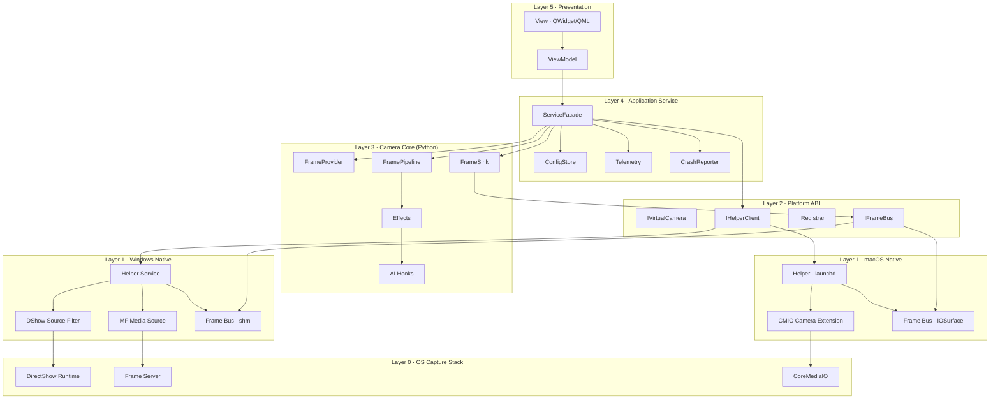
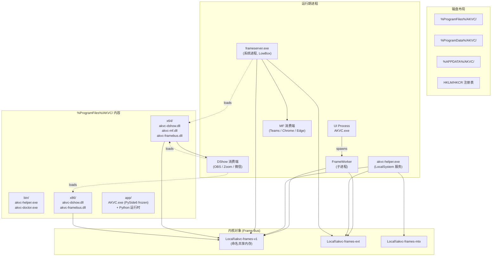
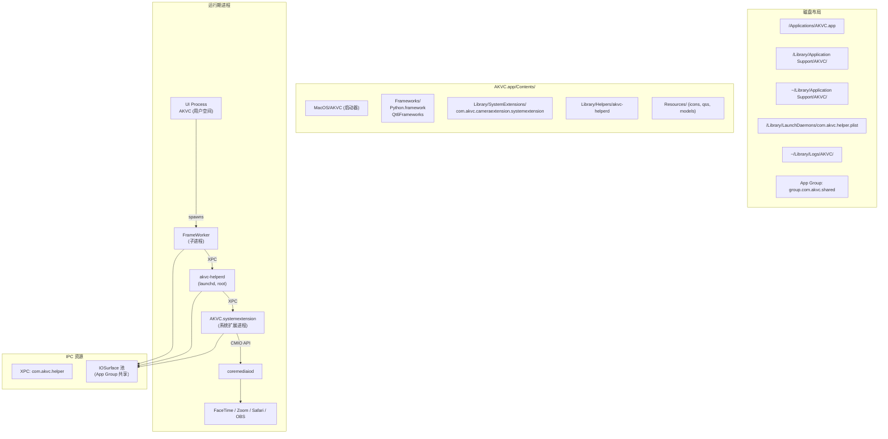
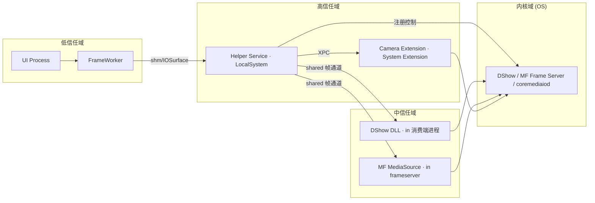

# Component Diagram — Cross-Platform Virtual Camera

**项目代号**：AK Virtual Camera
**文档版本**：v1.0
**阶段**：Phase 1 — 系统架构设计
**前置文档**：`system-design.md`、`class-diagram.md`、`sequence-diagram.md`

> 本文给出系统的**组件视图**与**部署视图**。
> 组件视图回答"系统由哪些组件构成 / 谁依赖谁"；
> 部署视图回答"运行期组件落在哪些进程、哪些机器目录、哪些 OS 服务"。

---

## 1. 顶层组件视图（跨平台）

依赖方向严格自上而下；同层组件之间不形成环。

---

## 2. Windows 部署视图

**关键字段**：

- 服务：`akvc-helper`，启动类型 `auto`，恢复策略 `restart/restart/restart`，账户 `LocalSystem`。
- 注册表：
  - `HKCR\CLSID\{...}\InprocServer32`（DShow，x64 与 x86 双注册）
  - `HKLM\SOFTWARE\Classes\CLSID\{...}\Filter Categories\{860BB310-...}`
  - `HKLM\SOFTWARE\AKVC\` 安装信息（版本、ProductCode）
- 共享内存 ACL：`D:(A;;GA;;;BA)(A;;GRGW;;;AC)(A;;GRGW;;;S-1-15-2-1)`。
- 日志：`%ProgramData%\AKVC\logs\helper.log`、`UI.log`、`worker.log`，按日切割。

---

## 3. macOS 部署视图

**关键字段**：

- launchd plist：`/Library/LaunchDaemons/com.akvc.helper.plist`，`KeepAlive=true`，`RunAtLoad=true`，`UserName=root`（仅在需要操作系统级注册时；Frame Bus 持有可降权）。
- 系统扩展位置：`AKVC.app/Contents/Library/SystemExtensions/com.akvc.cameraextension.systemextension`。
- entitlements：
  - 容器 App：`com.apple.security.app-sandbox`、`com.apple.developer.system-extension.install`、`com.apple.security.application-groups = ["group.com.akvc.shared"]`。
  - Camera Extension：`com.apple.security.app-sandbox`、`com.apple.security.application-groups = ["group.com.akvc.shared"]`、`Hardened Runtime`。
- 日志：`~/Library/Logs/AKVC/`（用户域）+ `os_log subsystem com.akvc`（Helper / Extension）。

---

## 4. 组件依赖矩阵

行 = 依赖方；列 = 被依赖方。✅ 表示允许依赖；❌ 表示禁止；空白 = 不直接依赖。

| 依赖方 ↓ \ 被依赖方 → | View | VM | SF | Core | ABI | WinNative | MacNative | OS |
|---|---|---|---|---|---|---|---|---|
| View | — | ✅ | ❌ | ❌ | ❌ | ❌ | ❌ | ❌ |
| ViewModel | ❌ | — | ✅ | ❌ | ❌ | ❌ | ❌ | ❌ |
| ServiceFacade | ❌ | ❌ | — | ✅ | ✅ | ❌ | ❌ | ❌ |
| Camera Core | ❌ | ❌ | ❌ | — | ✅ | ❌ | ❌ | ❌ |
| Platform ABI | ❌ | ❌ | ❌ | ❌ | — | ✅(impl) | ✅(impl) | ❌ |
| Win Native | ❌ | ❌ | ❌ | ❌ | ✅ | — | ❌ | ✅ |
| Mac Native | ❌ | ❌ | ❌ | ❌ | ✅ | ❌ | — | ✅ |

CI 强制：

- pre-commit grep 检查跨层非法 import（如 ViewModel 中 `import cv2`）。
- 平台层互斥：Win 代码不许 `#include <CoreMediaIO/...>`，反之亦然。

---

## 5. 部署单位与签名链

| 平台 | 部署单位 | 签名链 |
|---|---|---|
| Windows | `akvc-setup.exe` (NSIS, 总安装器) | EV 证书 → 安装器 + Helper.exe + 所有 .dll 双重签名 (SHA-256) |
| Windows | `AKVC.app/Contents/...` 内文件 (打包到 NSIS) | 同上 |
| macOS | `AKVC.pkg` (productbuild + 公证) | Developer ID Installer 签名 → 内含 .app 由 Developer ID Application 签名 |
| macOS | `AKVC.systemextension` | Developer ID Application + Hardened Runtime + entitlements |
| macOS | `akvc-helperd` | Developer ID Application + Hardened Runtime |

---

## 6. 网络与外部依赖（Runtime 层面）

| 组件 | 是否需要网络 | 用途 |
|---|---|---|
| UI App | 否（默认） | 仅当用户开启 telemetry/更新检查时 |
| Helper | 否 | 完全本机 |
| FrameWorker | 否 | 完全本机 |
| Telemetry exporter | 是（opt-in） | OTLP/gRPC 到自有后端 |
| 更新检查 | 是（opt-in） | HTTPS GET 静态 manifest |
| Crash 上报 | 是（opt-in） | HTTPS POST minidump |

默认零网络。所有出站连接都需用户在设置里 opt-in。

---

## 7. 构建矩阵

| 产物 | 构建工具 | 目标三元组 / SDK |
|---|---|---|
| akvc-dshow.dll | CMake + MSVC | x64-windows-msvc，x86-windows-msvc |
| akvc-mf.dll | CMake + MSVC | x64-windows-msvc，arm64-windows-msvc（可选） |
| akvc-framebus.dll | CMake + MSVC | x64 / x86 / arm64 |
| akvc-helper.exe | CMake + MSVC | x64-windows-msvc |
| AKVC.exe (frozen) | PyInstaller | x64-windows |
| akvc.systemextension | Xcode | universal (x86_64 + arm64), macOS 13+ |
| akvc-helperd | Xcode / SwiftPM | universal |
| AKVC.app | Xcode | universal |
| akvc-setup.exe | NSIS | n/a |
| AKVC.pkg | pkgbuild + productbuild | n/a |

CI runner：

- `windows-2022`：跑 MSVC + NSIS + pytest + 集成。
- `macos-14` (Apple Silicon)：跑 Xcode + pkgbuild + pytest + 集成。
- `macos-13` (Intel)：跑兼容性矩阵子集。
- `ubuntu-22.04`：仅跑 Lint / 平台无关 pytest（QT_QPA_PLATFORM=offscreen）。

---

## 8. 可观测性矩阵

| 信号类型 | 来源 | 收集器 | 出口 |
|---|---|---|---|
| 结构化日志 | UI / FrameWorker / Helper / Extension | structlog / os_log / EventLog | 本地文件 + opt-in 上报 |
| 指标 | Frame Worker / Helper | OpenTelemetry SDK | 本地 Prometheus exporter（默认 off） |
| 崩溃 | UI / FrameWorker / Helper / Extension | Crashpad | 本地 dump + opt-in 上报 |
| 事件追踪 | Helper / Frame Bus 关键事件 | EventLog（Win）/ os_log（Mac） | 系统级 |

---

## 9. 安全边界图

边界规则：

- 低信任域不许直接调用 OS 注册 API；必须经 Helper。
- 中信任域只读 Frame Bus；不写注册表 / 不接收控制命令。
- Helper 是唯一的"控制特权"持有者。
- Camera Extension 不接收来自非同 Team ID 进程的 XPC（macOS 强制）。

---

## 10. 与目录结构的映射

| 组件 | 源码路径 |
|---|---|
| View / ViewModel / ServiceFacade | `apps/desktop/akvc_app/{views,viewmodels,services}/` |
| FrameWorker | `apps/desktop/akvc_app/workers/` |
| Camera Core 各模块 | `akvc/core/{frame_provider,frame_pipeline,frame_sink,effects,ai,config,telemetry,metrics,errors}/` |
| Platform ABI | `platform-abi/include/akvc/`、`platform-abi/python/akvc/platform/` |
| 共享协议 | `virtualcam/shared/` |
| Win DShow | `virtualcam/windows/dshow/` |
| Win MF | `virtualcam/windows/mf/` |
| Win Helper | `virtualcam/windows/helper/` |
| Win Frame Bus | `virtualcam/windows/framebus/` |
| Mac Extension | `virtualcam/macos/extension/` |
| Mac Helper | `virtualcam/macos/helper/` |
| Mac Frame Bus | `virtualcam/macos/framebus/` |
| Win Installer | `installer/windows/` |
| Mac Installer | `installer/macos/` |
| 测试 | `tests/{unit,integration,e2e,perf,matrix}/` |
| 工具 | `tools/{make.py,sign.py,matrix_run.py,doctor/}` |

---

## 11. 验收（架构层）

- [ ] 组件视图与目录结构一一对应（§10）。
- [ ] 任意组件可在依赖图中找到唯一上游（无孤儿，无环）。
- [ ] 每个跨进程通道都有明确的 ACL/entitlement 约束（§2、§3）。
- [ ] 所有产物在签名/构建矩阵中有项（§5、§7）。
- [ ] 安全边界图与 §9.2 ACL 一致。

→ Phase 1 四份文档完毕。下一步：交付总结 + 等待确认 → 进入 Phase 2 Windows DirectShow MVP。
