# Sequence Diagram — Cross-Platform Virtual Camera

**项目代号**：AK Virtual Camera
**文档版本**：v1.0
**阶段**：Phase 1 — 系统架构设计
**前置文档**：`system-design.md`、`class-diagram.md`

> 本文给出系统在关键路径上的时序图，覆盖：开机/首启、注册、推帧、消费端打开（DShow/MF/CMIO）、错误恢复、升级、卸载、跨平台对照。
> 所有时序均为目标实现，作为 Phase 2/3/4 的契约。

---

## 1. 首次安装 → 启动 → 设备就绪（Windows）

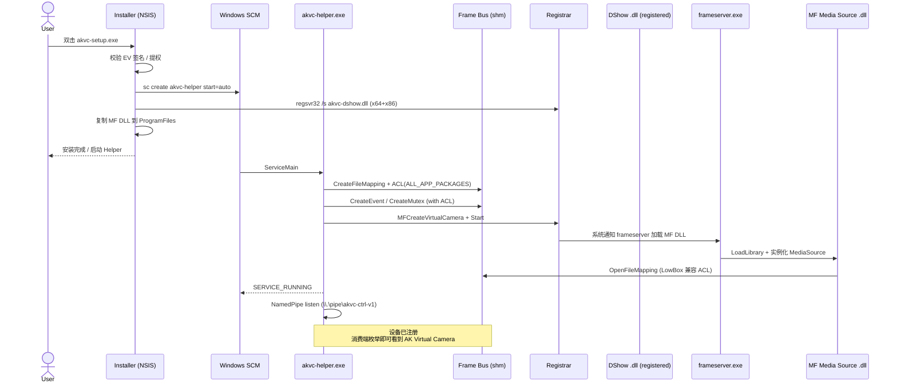

---

## 2. 首次安装 → 启动 → 设备就绪（macOS）

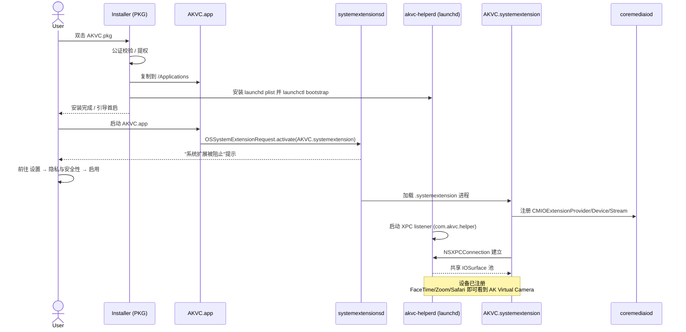

---

## 3. UI 启动 → 选择源 → 开始推流（跨平台共通）

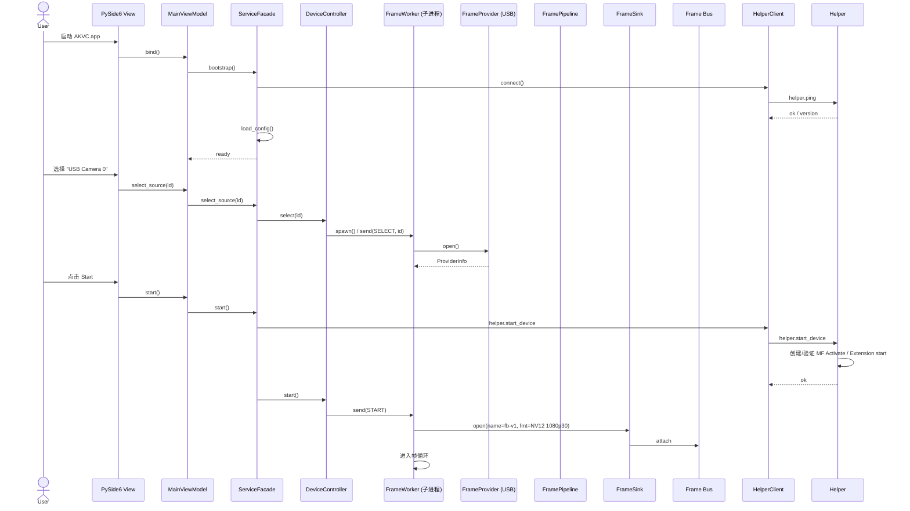

---

## 4. 帧循环（稳态推帧）

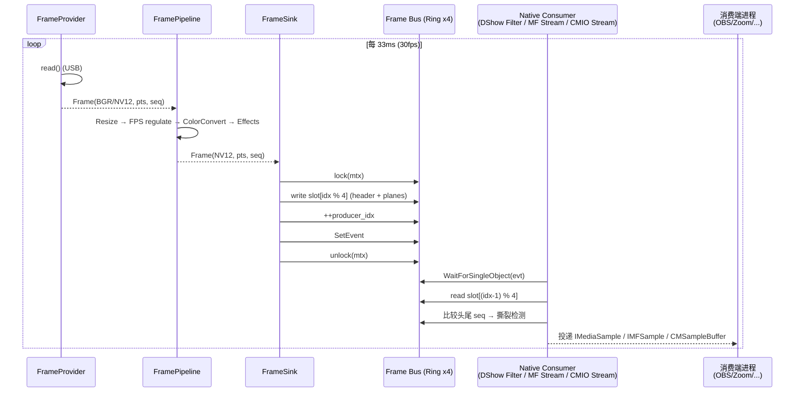

---

## 5. 消费端打开 — Windows DirectShow

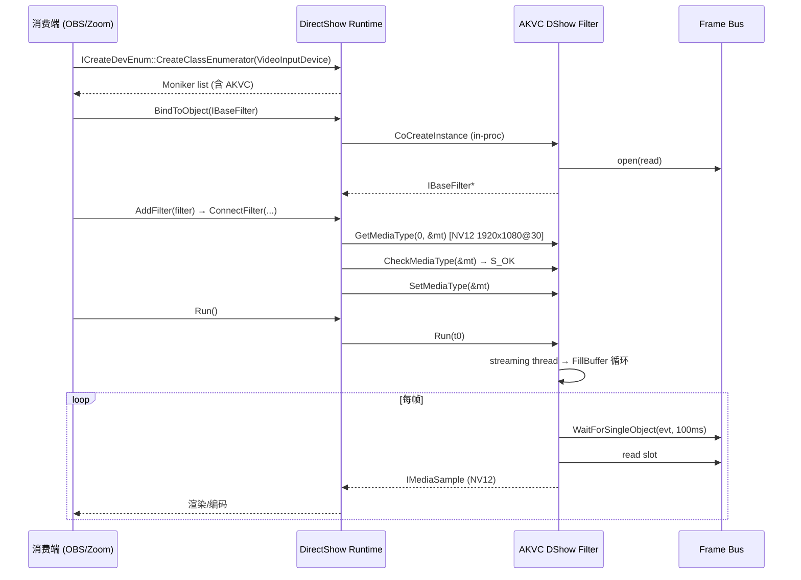

---

## 6. 消费端打开 — Windows Media Foundation

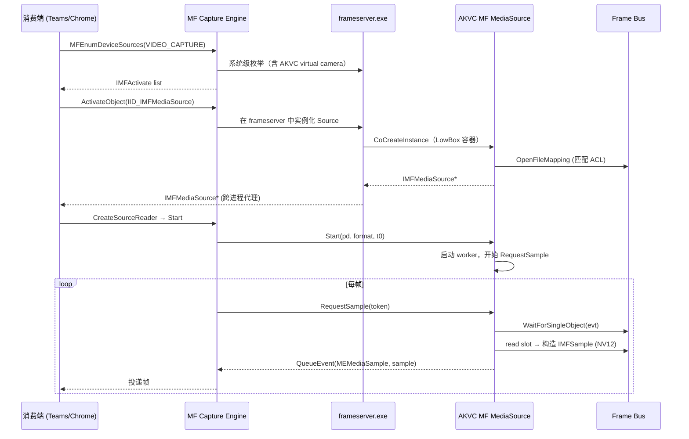

---

## 7. 消费端打开 — macOS CoreMediaIO

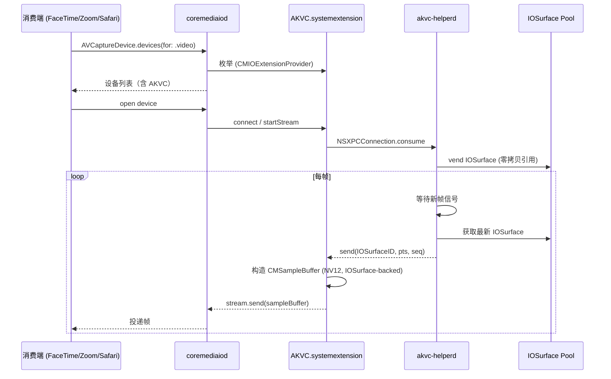

---

## 8. UI 关闭 / 崩溃 → 占位帧 兜底

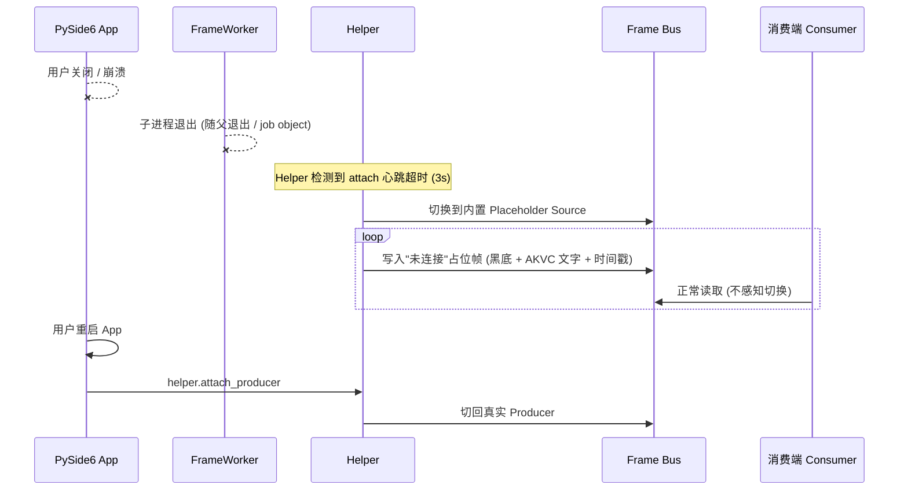

**不变量 I1 体现**：消费端**不会感知设备消失**。

---

## 9. 升级安装

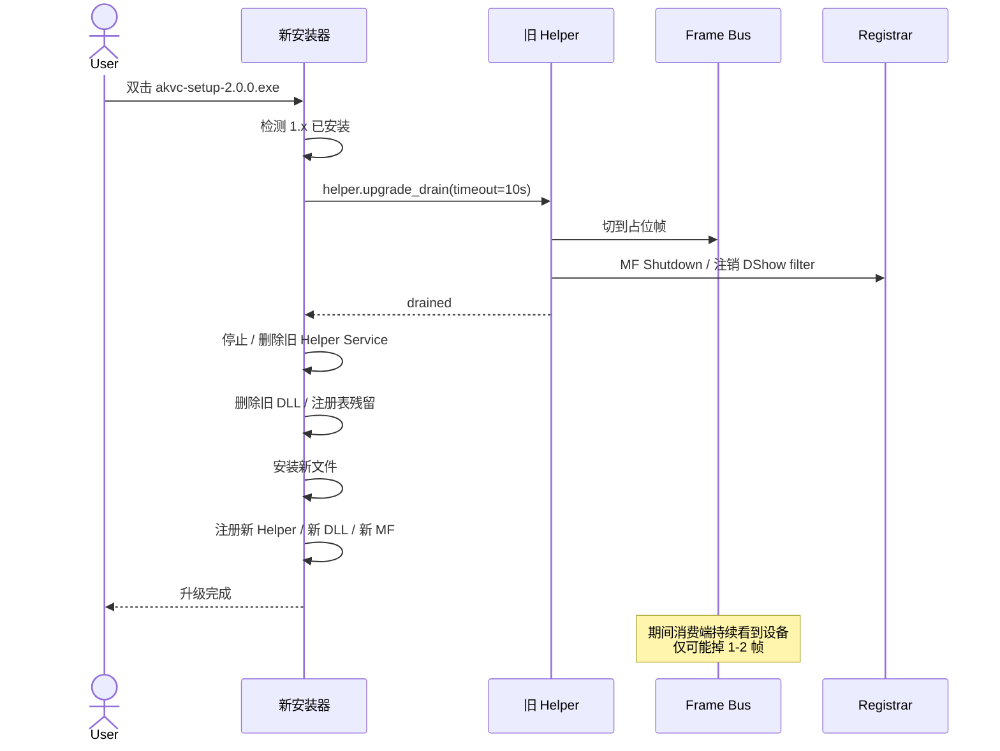

---

## 10. 卸载

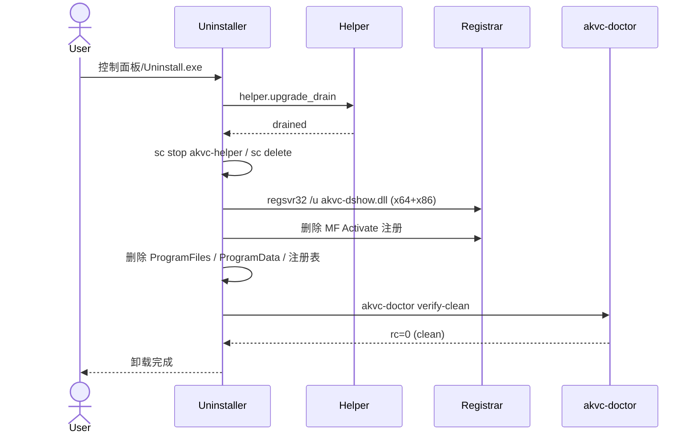

macOS 等价流程：`OSSystemExtensionRequest.deactivate` → 卸载 launchd → 删 App。

---

## 11. 错误恢复 — Helper 崩溃

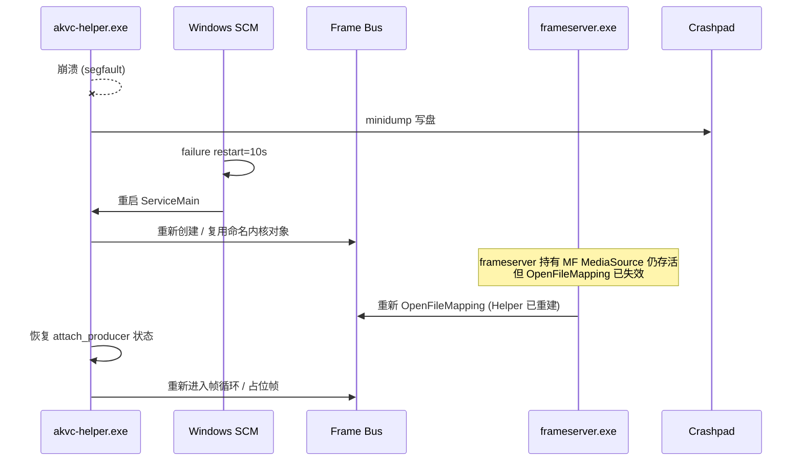

---

## 12. 错误恢复 — 帧路径异常

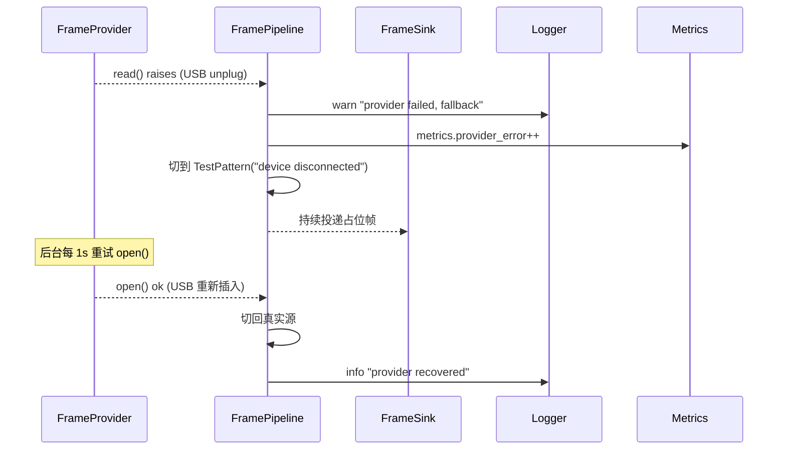

---

## 13. 配置变更 — 切换分辨率

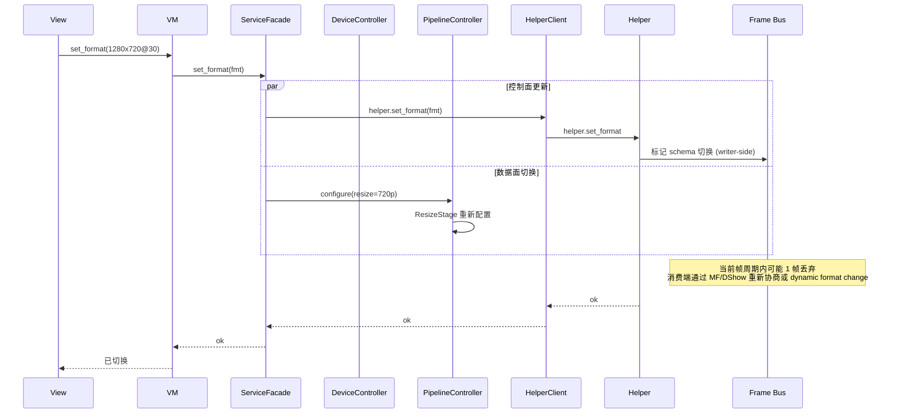

**注**：DShow 不支持运行期改变 MediaType；该路径会触发 Filter 重新连接（消费端 1–2 帧黑屏）。MF / CMIO 支持热切换。

---

## 14. AI 模型加载 (Phase 6 预演)

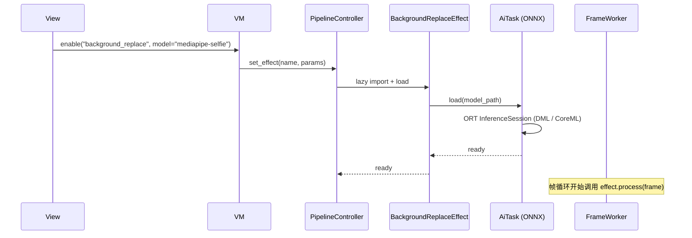

---

## 15. 自检流程 — `akvc-doctor`

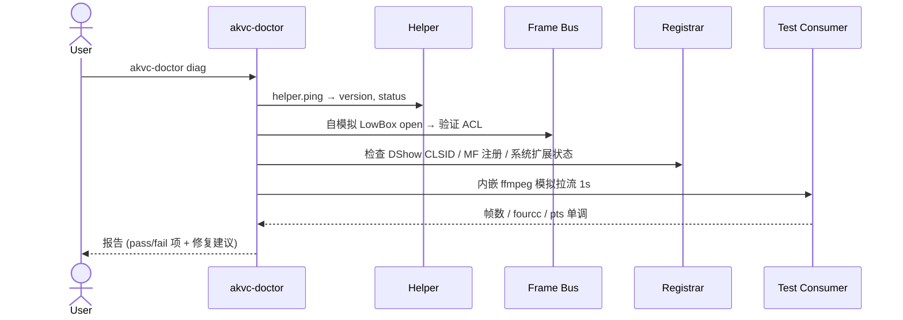

---

## 16. 跨平台路径对比一图

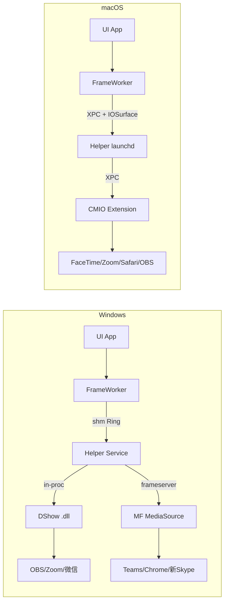

---

## 17. 跨流程 invariants 校验

| 不变量 | 体现于时序图 |
|---|---|
| I1 — UI 崩溃设备不消失 | §8 占位帧 |
| I2 — 安装/卸载干净 | §9 升级 / §10 卸载 / §15 doctor |
| I3 — 故障不抖动旧帧 | §12 错误恢复（切到占位） |
| I4 — Helper 拥有跨进程对象 | §1 §2 Helper 创建 ACL 对象 |
| I5 — MVVM 边界 | §3 View→VM→SF 链路 |

下一文档：`component-diagram.md` — 组件/部署图。
